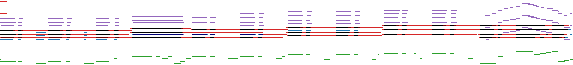
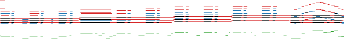
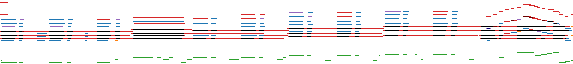
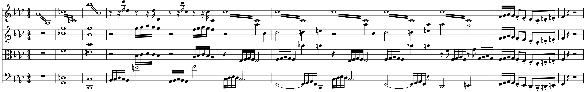
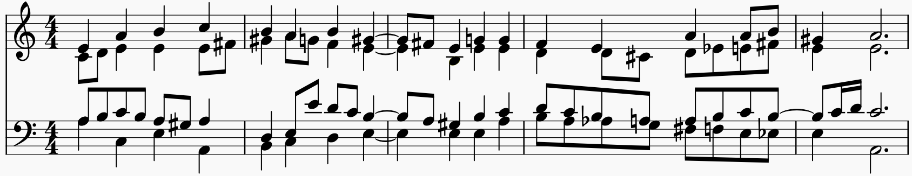

# Demo

- [Figure 1: _Cette année-là_ by Claude François](#fig1)
- [Figure 2: _String Quartet No. 11 in F minor, Op. 95, Movement 1_ by Ludwig van Beethoven](#fig2)
- [Figure 3: _Wer nur den lieben Gott läßt walten, BWV 434_ by Johann Sebastian Bach](#fig3)
- [Figure 4: _Theme of Universe_ from Miracle Ropit's Adventure in 2100](#fig4)
- [Figure 5: _Blame It On the Boogie_ by The Jacksons](#fig5)
- [Figure 6: _Quando Quando Quando_ by Tony Renis](#fig6)

> All samples are synthesized using FluidSynth with the MuseScore General soundfont.

---

## Figure 1: _Cette année-là_ by Claude François {#fig1}

(Colors: _piano_{:.blue}, _guitar_{:.orange}, _bass_{:.green}, _strings_{:.red}, _brass_{:.purple}.)

- Mixture (input)\\
  {:.score}\\
  

- Ground truth\\
  {:.score}\\
  
- Online LSTM prediction\\
  {:.score}\\
  
- Offline BiLSTM prediction\\
  {:.score}\\
  

---

## Figure 2: _String Quartet No. 11 in F minor, Op. 95, Movement 1_ by Ludwig van Beethoven {#fig2}

(Colors: _first violin_{:.blue}, _second violin_{:.orange}, _viola_{:.green}, _cello_{:.red}.)

{:style="max-width: none;"}

- Mixture (input)\\
  {:.score style="min-height: 60px;"}\\
  
- Ground truth\\
  {:.score style="min-height: 60px;"}\\
  
- Online LSTM prediction\\
  {:.score style="min-height: 60px;"}\\
  
- Offline BiLSTM prediction\\
  {:.score style="min-height: 60px;"}\\
  

---

## Figure 3: _Wer nur den lieben Gott läßt walten, BWV 434_ by Johann Sebastian Bach {#fig3}

(Colors: _soprano_{:.blue}, _alto_{:.orange}, _tenor_{:.green}, _bass_{:.red}.)

{:style="max-width: none;"}

- Mixture (input)\\
  {:.score}\\
  
- Ground truth\\
  {:.score}\\
  
- Online LSTM prediction\\
  {:.score}\\
  
- Offline BiLSTM prediction\\
  {:.score}\\
  

---

## Figure 4: _Theme of Universe_ from Miracle Ropit's Adventure in 2100 {#fig4}

(Colors: _pulse wave I_{:.blue}, _pulse wave II_{:.orange}, _triangle wave_{:.green}.)

- Mixture (input)\\
  {:.score}\\
  
- Ground truth\\
  {:.score}\\
  
- Online LSTM prediction\\
  {:.score}\\
  
- Offline BiLSTM prediction\\
  {:.score}\\
  

---

## Figure 5: _Blame It On the Boogie_ by The Jacksons {#fig5}

(Colors: _piano_{:.blue}, _guitar_{:.orange}, _bass_{:.green}, _strings_{:.red}, _brass_{:.purple}.)

- Mixture (input)\\
  {:.score}\\
  
- Ground truth\\
  {:.score}\\
  
- Online LSTM prediction\\
  {:.score}\\
  
- Offline BiLSTM prediction\\
  {:.score}\\
  

---

## Figure 6: _Quando Quando Quando_ by Tony Renis {#fig6}

(Colors: _piano_{:.blue}, _guitar_{:.orange}, _bass_{:.green}, _strings_{:.red}, _brass_{:.purple}.)

- Mixture (input)\\
  {:.score style="min-height: 60px;"}\\
  
- Ground truth\\
  {:.score style="min-height: 60px;"}\\
  
- Online LSTM prediction\\
  {:.score style="min-height: 60px;"}\\
  
- Offline BiLSTM prediction\\
  {:.score style="min-height: 60px;"}\\
  
