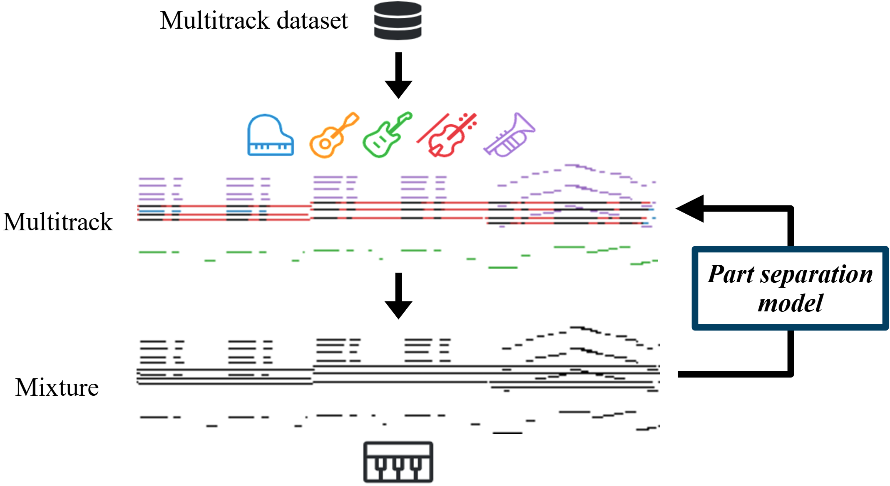

# Introduction

By downmixing a multitrack into a single-track mixture, we acquire paired data of solo music and its instrumentation. We then use these paired data to train a part separation model that aims to infer the part label (e.g., one out of the five instruments in this example) for each single note in a mixture. Automatic instrumentation can subsequently be accomplished by treating input from a keyboard player as a downmixed mixture (bottom) and separating out the relevant parts (top). The music is visualized in the piano-roll representation, where the x- and y-axes represent time and pitch, respectively.
