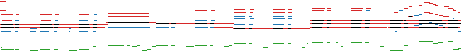
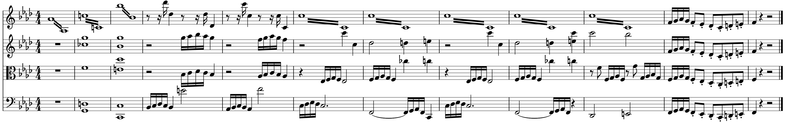

__Towards Automatic Instrumentation by Learning to Separate Parts in Symbolic Multitrack Music__
{:.center .larger}

[Hao-Wen Dong](https://salu133445.github.io/)<sup>1</sup> &emsp;
[Chris Donahue](https://chrisdonahue.com/)<sup>2</sup> &emsp;
[Taylor Berg-Kirkpatrick](https://cseweb.ucsd.edu/~tberg/)<sup>1</sup> &emsp;
[Julian McAuley](https://cseweb.ucsd.edu/~jmcauley/)<sup>1</sup>\\
<sup>1</sup> University of California San Diego &emsp;
<sup>2</sup> Stanford University
{:.center}

 &emsp;
 &emsp;
 &emsp;
 &emsp;
 &emsp;

{:.center}



---

## Content

- [Best Samples](#best-samples)
- [Cette année-là_ by Claude François (Figure 1)](#fig1)
- [_String Quartet No. 11 in F minor, Op. 95, Movement 1_ by Ludwig van Beethoven (Figure 2)](#fig2)
- [_Wer nur den lieben Gott läßt walten, BWV 434_ by Johann Sebastian Bach (Figure 3)](#fig3)
- [_Theme of Universe_ from Miracle Ropit's Adventure in 2100 (Figure 4)](#fig4)
- [_Blame It On the Boogie_ by The Jacksons (Figure 5)](#fig5)
- [_Quando Quando Quando_ by Tony Renis (Figure 6)](#fig6)
- [Citation](#citation)

---

## Important Notes

All samples are synthesized using [FluidSynth](https://www.fluidsynth.org/) with the MuseScore General [soundfont](https://musescore.org/en/handbook/3/soundfonts-and-sfz-files).

---

## Best Samples

<div class="table-wrapper" markdown="block">

| Mixture (input) | Predicted instrumentation (output) |
|:-:|:-:|
| (guitar) | (piano, guitar, bass, strings, brass) |
|  |  |
|  |  |
|  |  |

</div>

---

## _Cette année-là_ by Claude François (Figure 1) {#fig1}

> Colors: _piano_{:.blue}, _guitar_{:.orange}, _bass_{:.green}, _strings_{:.red}, _brass_{:.purple}.

<div class="table-wrapper" markdown="block">

| Mixture (input) | {:.score} |  |
| LSTM | {:.score} |  |
| BiLSTM | {:.score} |  |
| Ground truth | {:.score} |  |

</div>

---

## _String Quartet No. 11 in F minor, Op. 95, Movement 1_ by Ludwig van Beethoven (Figure 2) {#fig2}

> Colors: _first violin_{:.blue}, _second violin_{:.orange}, _viola_{:.green}, _cello_{:.red}.

<div class="table-wrapper" markdown="block">

| Mixture (input) | {:.score} |  |
| LSTM | {:.score} |  |
| BiLSTM | {:.score} |  |
| Ground truth | {:.score} |  |

</div>

> Original music score:
>
> 

---

## _Wer nur den lieben Gott läßt walten, BWV 434_ by Johann Sebastian Bach (Figure 3) {#fig3}

> Colors: _soprano_{:.blue}, _alto_{:.orange}, _tenor_{:.green}, _bass_{:.red}.

<div class="table-wrapper" markdown="block">

| Mixture (input) | {:.score} |  |
| LSTM | {:.score} |  |
| BiLSTM | {:.score} |  |
| Ground truth | {:.score} |  |

</div>

> Original music score:
>
> 

---

## _Theme of Universe_ from Miracle Ropit's Adventure in 2100 (Figure 4) {#fig4}

> Colors: _pulse wave I_{:.blue}, _pulse wave II_{:.orange}, _triangle wave_{:.green}.

<div class="table-wrapper" markdown="block">

| Mixture (input) | {:.score} |  |
| LSTM | {:.score} |  |
| BiLSTM | {:.score} |  |
| Ground truth | {:.score} |  |

</div>

---

## _Blame It On the Boogie_ by The Jacksons (Figure 5) {#fig5}

> Colors: _piano_{:.blue}, _guitar_{:.orange}, _bass_{:.green}, _strings_{:.red}, _brass_{:.purple}.

<div class="table-wrapper" markdown="block">

| Mixture (input) | {:.score} |  |
| LSTM | {:.score} |  |
| BiLSTM | {:.score} |  |
| Ground truth | {:.score} |  |

</div>

---

## _Quando Quando Quando_ by Tony Renis (Figure 6) {#fig6}

> Colors: _piano_{:.blue}, _guitar_{:.orange}, _bass_{:.green}, _strings_{:.red}, _brass_{:.purple}.

<div class="table-wrapper" markdown="block">

| Mixture (input) | {:.score} |  |
| LSTM | {:.score} |  |
| BiLSTM | {:.score} |  |
| Ground truth | {:.score} |  |

</div>

---

## Citation

> Hao-Wen Dong, Chris Donahue, Taylor Berg-Kirkpatrick, and Julian McAuley, "Towards Automatic Instrumentation by Learning to Separate Parts in Symbolic Multitrack Music," Proceedings of the International Society for Music Information Retrieval Conference (ISMIR), 2021.

```bibtex
@inproceedings{dong2021arranger,
    author = {Hao-Wen Dong and Chris Donahue and Taylor Berg-Kirkpatrick and Julian McAuley},
    title = {Towards Automatic Instrumentation by Learning to Separate Parts in Symbolic Multitrack Music},
    booktitle = {Proceedings of the International Society for Music Information Retrieval Conference (ISMIR)},
    year = 2021,
}
```
